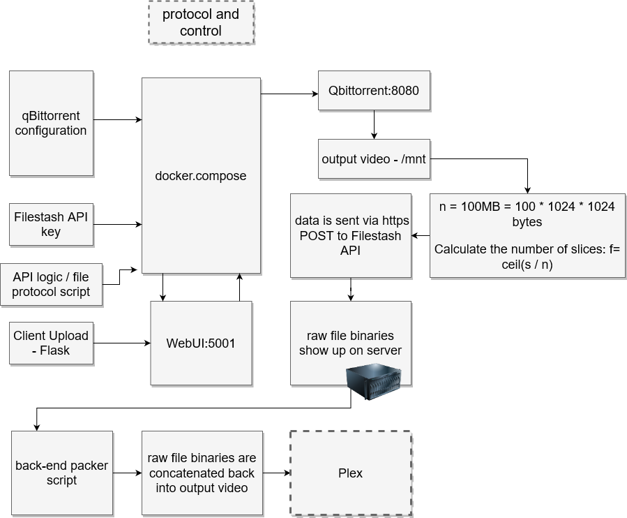

# qbit-filestash-protocol

git bash on DOS:

`git clone https://github.com/JakeTurner616/qbit-filestash-protocol/ && cd qbit-filestash-protocol && start start.bat && exit`

bash:

`git clone https://github.com/JakeTurner616/qbit-filestash-protocol/ && cd qbit-filestash-protocol`

`docker build -t qbitfilestashprotocol .`

`docker run --name  qbitfilestashprotocol -p 5001:5001 -p 8080:8080 qbitfilestashprotocol`

# diagram:

